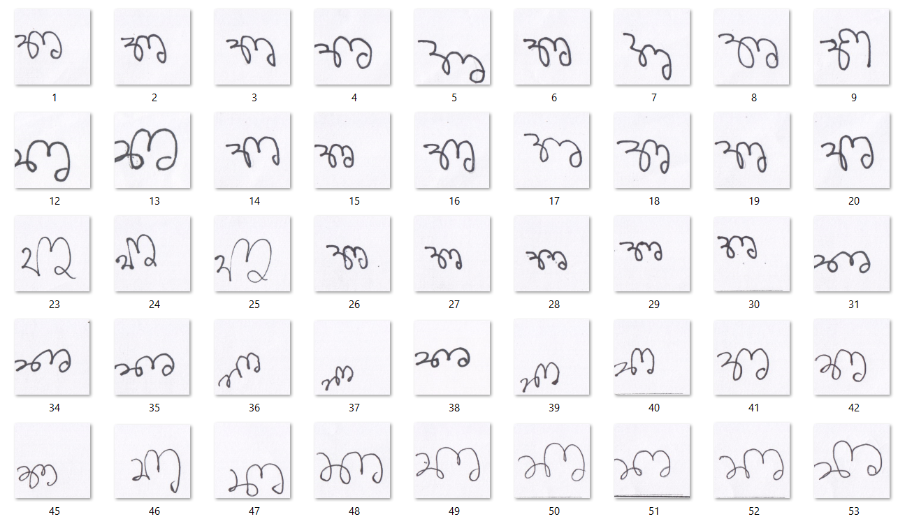
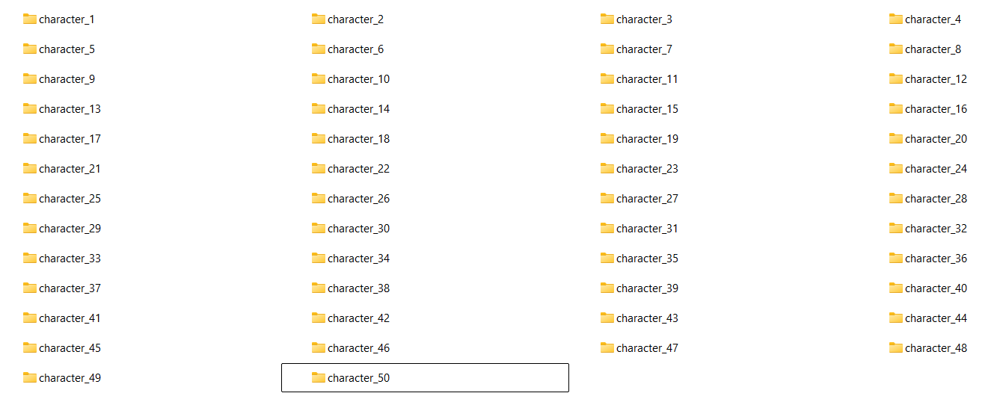
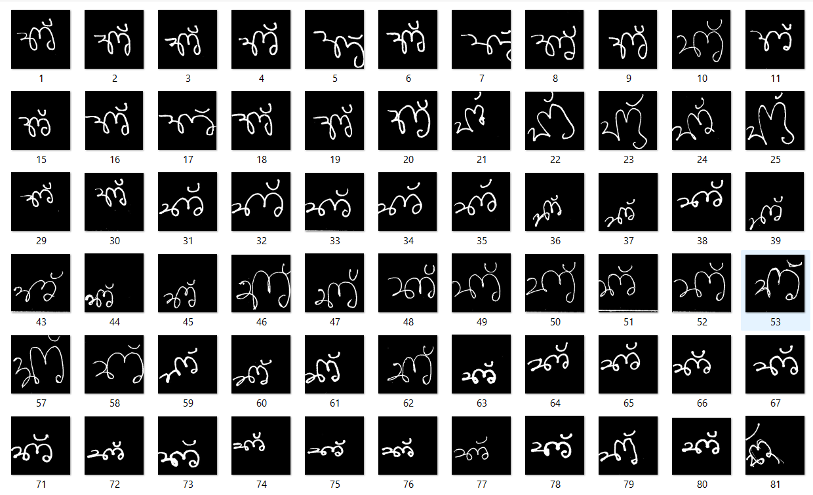
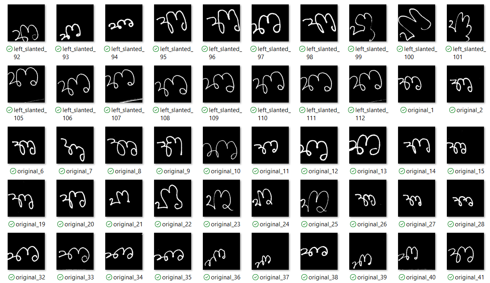
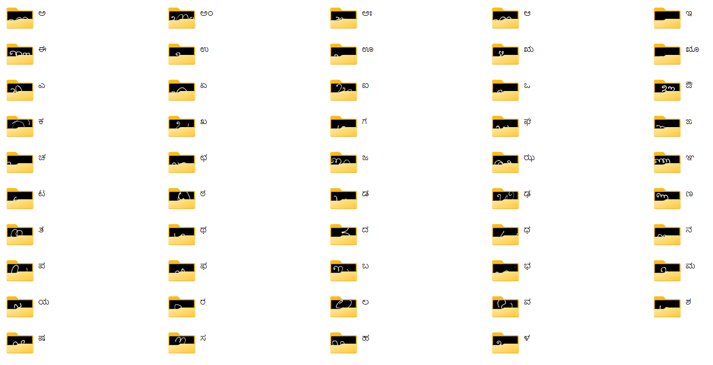
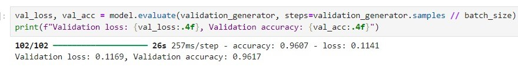
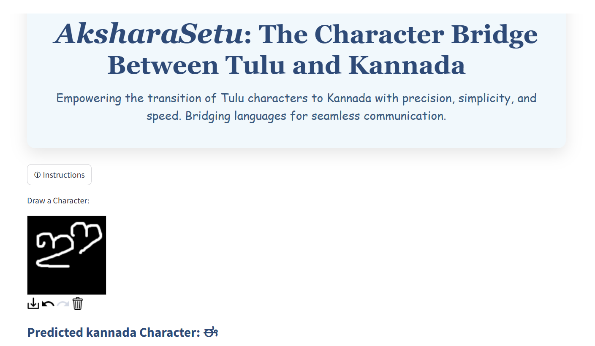
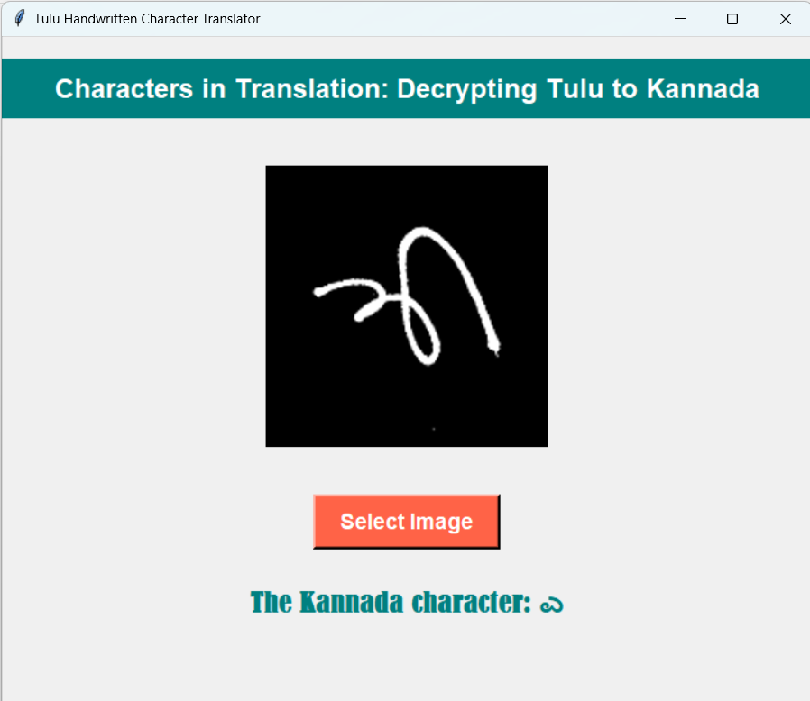

# _Characters in Translation: Decrypting Tulu to Kannada_

_This project focuses on developing a deep learning-based solution for translating characters from the Tulu script to Kannada. Tulu, an ancient Dravidian language spoken primarily in coastal Karnataka, lacks adequate computational resources for digitization and translation. This project leverages deep learning algorithms to recognize Tulu characters and translate them into Kannada. The use of maxpooling and Adam optimizer helped achieve 96% accuracy, providing a robust and efficient solution for cross-language character recognition._

## Project Workflow

**1. Preprocessing and Character Segmentation**

_The dataset consists of scanned A4 sheets containing handwritten Tulu characters, arranged in a 6x9 grid. In the preprocessing stage, each sheet is binarized (converted to black and white), and individual characters are extracted from each cell of the grid. These segmented characters are stored in separate folders, representing each Tulu character._

Images of segmented characters and stored in separate folders:

  
  

Image of preprocessed characters:

  

**2. Data Augmentation**

_To improve the model's ability to generalize to different handwriting styles, various augmentations are applied to the images. These include slanting the characters to simulate different writing angles. This process increases the size of the dataset and introduces variability, helping the model to handle diverse character styles._
Image of augmented characters:

  

**3. Tulu to Kannada Mapping**

_The project includes a mapping system where each recognized Tulu character is mapped to its corresponding Kannada character. This feature enables the OCR model to not only recognize Tulu characters but also translate them into Kannada text._
Image of folder after mapping:

  

**4.Model Training**

_A Convolutional Neural Network (CNN) model is trained using the segmented and augmented dataset to classify 49 distinct Tulu characters. The architecture consists of three convolutional layers, each followed by MaxPooling to reduce spatial dimensions and enhance feature extraction. Dropout layers are included for regularization, preventing overfitting. Finally, fully connected layers are utilized for character classification, enabling the model to effectively map the learned features to the corresponding characters in the Tulu script._

  

**5. GUI and Prediction**

_A user-friendly graphical user interface (GUI) is developed using Tkinter, enabling users to upload images of handwritten Tulu characters seamlessly. The application preprocesses the selected images and leverages the trained model to predict and display the corresponding Kannada character, enhancing the overall accessibility and usability of Tulu character recognition._

  
  

