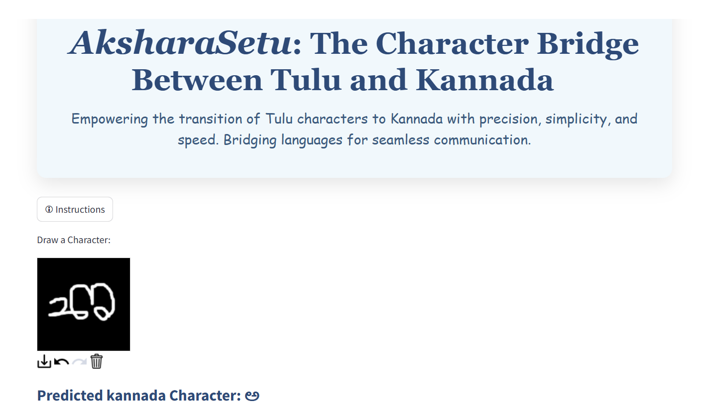

# _AksharaSetu: The Character Bridge Between Tulu and Kannada_

_AksharaSetu is a deep learning-based project designed to recognize and translate handwritten Tulu characters into their Kannada equivalents. This application leverages a Convolutional Neural Network (CNN) model and a user-friendly interface powered by Streamlit, facilitating seamless Tulu-to-Kannada translation for language preservation and educational use._

## Project Workflow

**1. Preprocessing and Character Segmentation**

_The dataset consists of scanned A4 sheets containing handwritten Tulu characters, arranged in a 6x9 grid. In the preprocessing stage, each sheet is binarized (converted to black and white), and individual characters are extracted from each cell of the grid. These segmented characters are stored in separate folders, representing each Tulu character._

Images of segmented characters and stored in separate folders:

  
  

Image of preprocessed characters:

  

**2. Data Augmentation**

_To improve the model's ability to generalize to different handwriting styles, various augmentations are applied to the images. These include slanting the characters to simulate different writing angles. This process increases the size of the dataset and introduces variability, helping the model to handle diverse character styles._
Image of augmented characters:

  

**3. Tulu to Kannada Mapping**

_The project includes a mapping system where each recognized Tulu character is mapped to its corresponding Kannada character. This feature enables the OCR model to not only recognize Tulu characters but also translate them into Kannada text._
Image of folder after mapping:

  

**4.Model Training**

_A Convolutional Neural Network (CNN) model is trained using the segmented and augmented dataset to classify 49 distinct Tulu characters. The architecture consists of three convolutional layers, each followed by MaxPooling to reduce spatial dimensions and enhance feature extraction. Dropout layers are included for regularization, preventing overfitting. Finally, fully connected layers are utilized for character classification, enabling the model to effectively map the learned features to the corresponding characters in the Tulu script._

  

**5. User Interface**

_Streamlit is used to build the interactive web interface for AksharaSetu, providing an easy-to-use platform for character recognition. The interface includes a drawing canvas, powered by streamlit_drawable_canvas, where users can draw Tulu characters directly in the browser. Once the character is drawn, the model predicts the corresponding Kannada character and displays it on the screen. Additionally, an instructions button is available to guide users on how to draw the characters for accurate recognition. Streamlit's simple, responsive layout ensures an intuitive and seamless experience for Tulu-to-Kannada translation._

  
  

